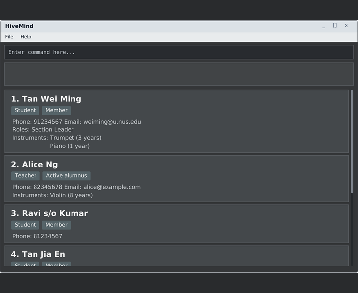

# HiveMind

HiveMind is a desktop application for managing member information. It is designed for users who prefer the speed of a command-line interface while still benefiting from a graphical display of their records.

Users can add, delete, list, find, and filter members. Each member record can include a name, phone number, email address, member type, status, instruments, and years of experience with each instrument. HiveMind also supports saving and loading data, as well as `help` and `exit` commands.

This project is based on the AddressBook-Level3 project created by the [SE-EDU initiative](https://se-education.org).
