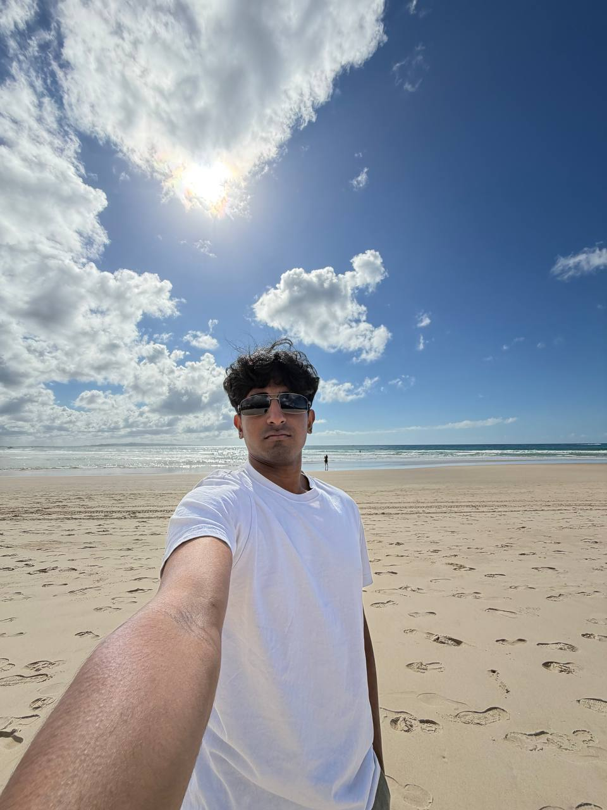

We are a team based in the [School of Computing, National University of Singapore](https://www.comp.nus.edu.sg).

You can reach us at the email `seer[at]comp.nus.edu.sg`

## Project team

### Tristan Ng

[[github](https://github.com/trigg770)]

* Role: Developer
* Responsibilities: Code Quality

### Nahum Liow

[[github](https://github.com/liownahum)]
[[portfolio](team/johndoe.md)]

* Role: Software Developer
* Responsibilities: UI

### Fredrick CC

[[github](https://github.com/L0pch)]

* Role: Developer
* Responsibilities: Data

### Chun Sheng

[[github](http://github.com/cs28118)]

* Role: Developer
* Responsibilities: Scheduling and tracking

### Irvin Tan Wei Jie

[[github](http://github.com/irtan-cell)]

* Role: Developer
* Responsibilities: Integration
